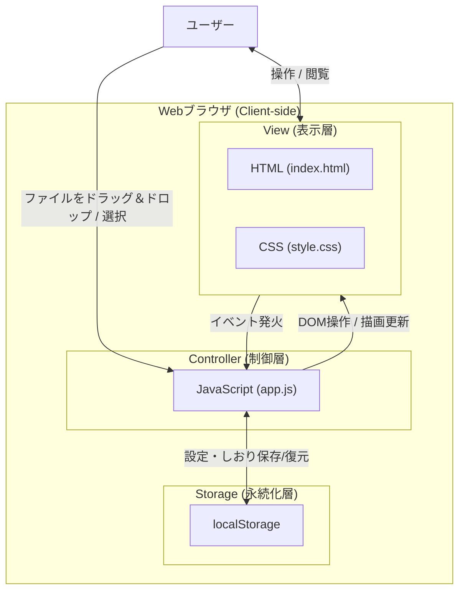
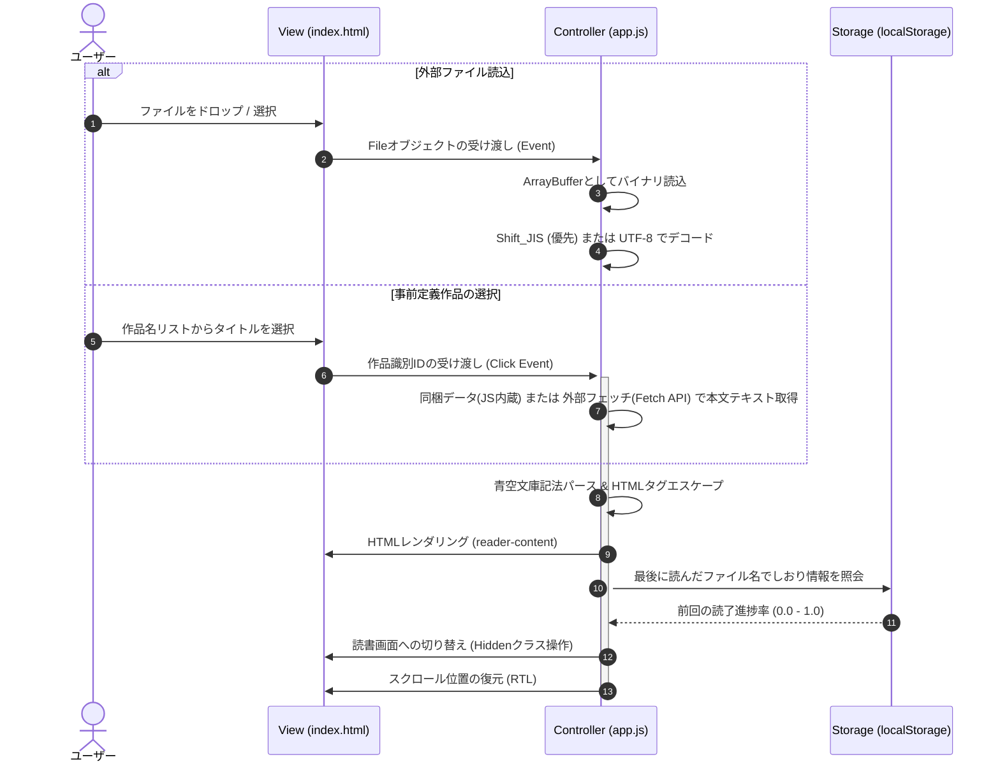

# [DSN-01] 基本設計書 (High-Level Design) - ゆうぞら (Yuzora)

本ドキュメントは、要件定義書（[REQ-03-system_requirements.md](/docs/REQ-03-system_requirements.md)）に規定されたシステム要件に基づき、青空文庫縦書きビューアー「ゆうぞら (Yuzora)」の基本設計（High-Level Design）を定義します。

---

## 1. システム構成・アーキテクチャ (System Architecture)

ゆうぞらは、サーバーサイド処理を一切行わない完全な**クライアントサイド静的シングルページアプリケーション (SPA)** です。

### 1.1 アーキテクチャ図 (構造モデル)

### 1.2 各コンポーネントの役割

| レイヤー / コンポーネント | 技術・ファイル名 | 役割と責務 |
| :--- | :--- | :--- |
| **表示レイヤー (View)** | [index.html](/index.html) [style.css](/src/css/style.css) | ユーザーインターフェースの構造定義およびスタイリング。縦書き表示レイアウトの提供、各種設定パネル（ドロワー）およびウェルカム画面の構築。 |
| **制御レイヤー (Controller)** | [app.js](/src/js/app.js) | ファイル読み込み、Shift_JISデコード、青空文庫記法のパース、表示設定の動的適用、スクロール進捗率の計算、LocalStorageとの連携等のアプリケーションロジック。 |
| **永続化レイヤー (Storage)** | `localStorage` | セッションを跨いだユーザー設定（テーマ、フォントサイズ等）およびしおり情報（読了進捗率、最後に読んだファイルの内容・メタデータ）の永続化。 |

### 1.3 アーキテクチャドメインとADR（意思決定記録）の位置づけ
* **TOGAF EA との位置づけ**:
  本ドキュメントは、**TOGAF EA** の「アプリケーションアーキテクチャ (AA)」「データアーキテクチャ (DA)」「テクノロジーアーキテクチャ (TA)」における**論理（概念）設計**を定義します。各レイヤーの境界、画面遷移、カラー変数名などを論理的に規定します。
* **ADR (Architecture Decision Record) との連携**:
  本基本設計に至る過程で議論・策定された、Vanilla JSの選定、CSSマルチカラムの採用、セッション復元の持ち方などの重要なアーキテクチャ意思決定は、[docs/adr/](/docs/adr/) 配下に個別のドキュメントとして記録・管理されます。
* **設計ドキュメント間のすみ分け**:
  要件定義（SRD）や詳細設計（LLD）との境界、およびオーバーラップした際のすみ分け・分掌については、[文書管理・ドキュメント台帳](/docs/MNG-01-document_ledger.md) に規定されている「設計ドキュメント間のすみ分けと分掌」に従います。

---

## 2. 画面遷移とデータフロー (Screen Transitions & Data Flow)

### 2.1 画面状態 (Screen States)
アプリケーションは以下の3つの主要な画面状態を管理します。

1. **ウェルカム画面 (Welcome Screen)**
   - ファイルが読み込まれていない状態の初期画面。
   - ファイルのドラッグ＆ドロップエリア、ファイル選択ボタンを表示。
   - **事前定義作品の選択リスト**: 吉川英治「宮本武蔵」8作品の一覧を選択UIとして提示し、ユーザーがワンタップで直接読み込めるようにします。
2. **読書画面 (Reader Screen)**
   - ファイルの読み込み・パース完了、または事前定義作品のロード・パース完了後に遷移する読書メイン画面。
   - 縦書き表示、ヘッダー（自動非表示）、フッター（進捗率・ページ数表示）、ページ送りナビゲーションエリアで構成。
3. **設定ドロワー (Settings Drawer)**
   - 読書画面で「表示設定」ボタンを押した際に表示されるサイドメニュー。
   - テーマ、フォント、文字サイズ、行間、文字間などのリアルタイム変更を制御。

### 2.2 ファイル読み込みから描画までのデータフロー

### 2.3 画面構成要素一覧 (UI Screen Component Breakdown)

本アプリケーションを構成する主要な3画面のDOM・UI構成要素、対応する識別子（ID/クラス名）、およびそれぞれの論理的な役割は以下の通りです。

#### 1. ウェルカム画面 (Welcome Screen)
ファイル未読み込み時の初期画面です。画面全体のコンテナ要素は `#welcome-screen`（クラス名: `.welcome-screen`）です。

| 構成要素名 | 識別子 (ID / Class) | 親要素 | 役割・機能説明 |
| :--- | :--- | :--- | :--- |
| **カードコンテナ** | `.welcome-card` | `#welcome-screen` | ウェルカム画面のコンテンツ全体を中央配置で内包するボックス。 |
| **ロゴ領域** | `.logo` | `.welcome-card` | アプリケーションのロゴおよびサブタイトルを表示する領域。 |
| ├ ロゴテキスト | `.logo-text` | `.logo` | 「ゆうぞら」のロゴ文字列表示。 |
| └ サブタイトル | `.logo-sub` | `.logo` | 「青空文庫 縦書きビューアー」の表示。 |
| **説明文** | `.description` | `.welcome-card` | アプリケーションの概要およびドラッグ＆ドロップ動作を説明するテキスト。 |
| **ドロップゾーン** | `#drop-zone` / `.drop-zone` | `.welcome-card` | ファイルのドロップイベントを待ち受ける枠線付きのドラッグエリア。 |
| ├ アイコン | `.icon-upload` | `#drop-zone` | アップロードを視覚的に表現するSVGアイコン。 |
| ├ ドラッグ案内 | `.drop-text` | `#drop-zone` | 「ファイルをここにドラッグ＆ドロップ」の文字列表示。 |
| ├ 接続詞 | `.drop-or` | `#drop-zone` | 「または」の文字列表示。 |
| └ ファイル選択ボタン | `label.btn-primary` | `#drop-zone` | クリックでファイルブラウザを起動する装飾ボタン。 |
| **ファイルインプット** | `#file-input` | `label` 内 | `<input type="file" accept=".txt,.html,.xhtml">`（CSSで実体は非表示）。 |
| **事前定義作品セクション** | `.predefined-books-section`| `.welcome-card` | ローカルにファイルがないユーザー向けのオススメ作品選択領域。 |
| ├ セクションタイトル | `.section-title` | `.predefined-books-section`| 「開発者のオススメ本」または「読書家のオススメ本」の文字列表示。 |
| └ 作品グリッド | `#developer-books-grid` / `#reader-books-grid` / `.predefined-books-grid` | `.predefined-books-section`| JavaScriptにより、それぞれのカテゴリ（開発者・読書家）の作品カードが動的に流し込まれるコンテナ。 |
| **作品カード** | `.book-card` (動的生成) | 作品グリッド内 | 個々の作品を選択するためのボタン型カード要素。 |
| ├ カバー | `.book-card-cover` | `.book-card` | 本の表紙を模した、和風の縦書きタイトル表示領域。 |
| └ メタ情報 | `.book-card-meta` | `.book-card` | 作品の巻数や著者名等のメタ情報を横書きで表示する領域。 |
| **ヘルプセクション** | `.help-section` | `.welcome-card` | 青空文庫からのダウンロード手順・利用方法を説明する領域。 |

#### 2. 読書画面 (Reader Screen)
ファイルを読み込んだ後に遷移するメインの閲覧画面です。画面全体のコンテナ要素は `#reader-screen`（クラス名: `.reader-screen`）であり、未ロード時は `.hidden` クラスによって非表示化されます。

| 構成要素名 | 識別子 (ID / Class) | 親要素 | 役割・機能説明 |
| :--- | :--- | :--- | :--- |
| **ヘッダーコントロール** | `.reader-header` | `#reader-screen` | 画面上部の操作・表示ヘッダー。マウス移動やタップで一時表示され、自動フェードアウトする。 |
| ├ ホーム戻るボタン | `#btn-back` / `.btn-icon` | `.reader-header` | 文字記号 `⌂`。クリック時に読書画面を閉じ、ウェルカム画面へと戻る。 |
| ├ 作品タイトル表示 | `#book-title` / `.book-title` | `.reader-header` | 読み込み中の作品名（またはファイル名）を中央に表示する領域。 |
| └ 右側コントロール | `.right-controls` | `.reader-header` | ヘッダー右側に配置される操作ボタン群。 |
| 　├ 最初へボタン | `#btn-first-page` / `.btn-icon`| `.right-controls` | SVGアイコン。ワンクリックで作品の先頭（最初のページ）へジャンプする。 |
| 　└ 表示設定ボタン | `#btn-settings` / `.btn-icon` | `.right-controls` | SVG（歯車）アイコン。クリック時に設定ドロワーを起動する。 |
| **読書ビューポート** | `#reader-viewport` / `.reader-viewport` | `#reader-screen` | スクロールやスワイプを検知し、表示範囲を制限するメイン表示窓（`overflow-x: hidden`）。 |
| └ 本文表示コンテナ | `#reader-content` / `.reader-content` | `#reader-viewport` | パースされた縦書きHTMLが動的に流し込まれるコンテナ。テーマやフォント等の設定クラスが動的に付与される。 |
| **ページナビゲーション** | `.page-nav` (左右共通) | `#reader-screen` | 画面左右の両端（全高）にオーバーレイされた透明なクリック/タップターゲット。 |
| ├ 左側タップエリア | `#page-nav-left` / `.page-nav-left`| `#reader-screen` | 左側のタップエリア。「次のページへ」を割り当て（RTL時）。 |
| └ 右側タップエリア | `#page-nav-right` / `.page-nav-right`| `#reader-screen` | 右側のタップエリア。「前のページへ」を割り当て（RTL時）。 |
| **フッターコントロール** | `.reader-footer` | `#reader-screen` | 画面下部に配置される進捗コントロール。ヘッダーと同様に自動フェードアウトする。 |
| ├ 進捗バーコンテナ | `.progress-bar-container` | `.reader-footer` | 進捗バーを配置する外枠。 |
| 　├ 進捗バートラック | `#progress-bar` / `.progress-bar` | `.progress-bar-container` | 進捗を示す横バー。クリック・ドラッグ（スクラブ）による位置移動を検知。 |
| 　└ 進捗つまみ | `#progress-thumb` / `.progress-thumb` | `#progress-bar` | 現在位置を視覚化する進捗バー上の丸形インジケータ。 |
| └ フッター情報表示 | `.footer-info` | `.reader-footer` | テキストによる進捗状況の表示。 |
| 　├ 読了進捗率 | `#reading-percentage` | `.footer-info` | 現在位置の読了割合（「〇%」）を表示。 |
| 　└ ページ数表示 | `#reading-index` | `.footer-info` | 現在のページ位置と総ページ数（「〇 / 〇 ページ」）を表示。 |

#### 3. 設定ドロワー (Settings Drawer)
読書画面の設定ボタンで起動するサイドメニューです。ドロワー本体は `#settings-drawer`（クラス名: `.settings-drawer`）で、背面には暗幕 `#drawer-overlay`（クラス名: `.drawer-overlay`）がオーバーレイされます。

| 構成要素名 | 識別子 (ID / Class) | 親要素 | 役割・機能説明 |
| :--- | :--- | :--- | :--- |
| **ドロワーヘッダー** | `.drawer-header` | `#settings-drawer` | ドロワー最上部のタイトルおよびクローズ領域。 |
| ├ ドロワータイトル | `h2` | `.drawer-header` | 「表示設定」のテキスト表示。 |
| └ 閉じるボタン | `#btn-close-settings` / `.btn-icon`| `.drawer-header` | SVG（×）アイコン。クリック時にドロワーおよび背面暗幕を閉じる。 |
| **ドロワーコンテンツ** | `.drawer-content` | `#settings-drawer` | スタイル調整用セレクターを格納するスクロール可能な設定グループ群。 |
| ├ テーマ設定 | `.settings-group` (テーマ用) | `.drawer-content` | 背景色・カラーテーマ（和紙、明、暗、漆黒）を切り替えるボタン群。 |
| ├ 書体設定 | `.settings-group` (書体用) | `.drawer-content` | 表示フォント（明朝体、ゴシック体）を切り替えるボタン群。 |
| ├ ページ送り方向 | `.settings-group` (送り方向用) | `.drawer-content` | ページの進行・スクロール方向（右から左、左から右）を切り替えるボタン群。 |
| ├ 文字サイズ設定 | `.settings-group` (サイズ用) | `.drawer-content` | 文字サイズ（小、中、大、特大）を切り替えるボタン群。 |
| ├ 行間設定 | `.settings-group` (行間用) | `.drawer-content` | カラム内の行送り幅（狭い、標準、広い）を切り替えるボタン群。 |
| └ 文字間設定 | `.settings-group` (文字間用) | `.drawer-content` | 各文字の間隔（狭い、標準、広い）を切り替えるボタン群。 |
| └ 開発者向け設定 | `.settings-group.dev-section` | `.drawer-content` | デバッグモーダルを起動する「デバッグ画面を開く」ボタン（`#btn-open-debug`）を内包する領域。 |

#### 4. デバッグモーダル (Debug Modal)
開発者向けのアプリ状態モニターおよび `localStorage` 操作を行うモーダル画面です。コンテナ要素は `#debug-modal`（クラス名: `.debug-modal`）で、背面には暗幕 `#debug-modal-overlay`（クラス名: `.debug-modal-overlay`）がオーバーレイされます。

| 構成要素名 | 識別子 (ID / Class) | 親要素 | 役割・機能説明 |
| :--- | :--- | :--- | :--- |
| **モーダルヘッダー** | `.debug-modal-header` | `#debug-modal` | タイトルと閉じるボタンの領域。 |
| ├ タイトル | `h2` | `.debug-modal-header` | 「デバッグ情報 & 操作」のテキスト表示。 |
| └ 閉じるボタン | `#btn-close-debug` / `.btn-icon`| `.debug-modal-header` | モーダルを閉じるボタン。 |
| **モーダルボディ** | `.debug-modal-body` | `#debug-modal` | 内部状態と操作用のボタン群。 |
| ├ 状態モニター | `.debug-modal-section` (モニター用) | `.debug-modal-body` | アプリの状態変数をリアルタイム表示する領域。 |
| 　└ モニタープレビュー | `#debug-monitor` | `.debug-monitor-container` | JSON化した内部状態のテキストプレビュー。 |
| └ 操作パネル | `.debug-modal-section` (操作用) | `.debug-modal-body` | `localStorage` の初期化を行うボタン群。 |
| 　├ しおり初期化ボタン | `#btn-clear-bookmarks` | `.debug-buttons` | クリック時に読書履歴や各作品の進捗データを削除。 |
| 　├ 設定初期化ボタン | `#btn-clear-config` | `.debug-buttons` | クリック時に表示カスタマイズ設定をデフォルトにリセット。 |
| 　└ 完全初期化ボタン | `#btn-clear-all` | `.debug-buttons` | 全ての `localStorage` をクリアしてアプリを強制再読込。 |

---

## 3. UI/UX・デザインシステム (UI/UX & Design System)

ユーザーがマニュアルを必要とせず、手に入れた瞬間から自然かつ直感的に操作できることを最優先の設計方針とし、高級感のあるレイアウトとシームレスな操作性を提供します。

### 3.0 直感的な操作重視の設計原則
* **メンタルモデルの同期**: 伝統的な縦書き本（右から左へめくる）の読書体験をデジタル上で再現するため、スワイプ方向、クリックナビゲーション、プログレスバーの充填方向およびつまみの移動といった全ての挙動が、選択した「ページの送り方向」と同一の方向感覚で動作することを保証します。
* **リアルタイムフィードバック**: プログレスバーのドラッグ（スクラブ）時など、ユーザーのアクションに対して遅延なくリアルタイムにページ描画を同期させ、物理的な本の「パラパラめくり」に近い直感的な手応えを与えます。
* **キーボード操作の直感化**: PCユーザー向けに、直感的に推測可能なキー割り当て（左右キーによる進む・戻る、上下キーによるUIの開閉）を定義し、ユーザーが迷うことなくビューアーを制御できるようにします。

### 3.1 縦書き・マルチカラム・レイアウト
- CSSの `writing-mode: vertical-rl` を用い、日本語本来の右から左へ流れる縦書き読書環境を提供します。
- PCなどの大画面では**2カラム（見開き）風**、モバイルなどの小画面（画面幅767px以下）では確実に **単一カラム（1段組み）** となるよう、CSSのマルチカラム（`column-width`）プロパティに viewport 幅からパディングを差し引いた値を設定し、表示を1カラムに強制します。また、フレックス要素の高さ潰れによる二段化や空白バグを避けるため、スクロールコンテナをブロック要素にし、コンテンツ高さを100%に固定して上端に揃えます。さらに、親要素の `direction: rtl`（RTLスクロール制御用）が子要素のテキストフローに波及して文字進行が「下から上」に反転するのを防ぐため、テキスト表示要素自体の `direction` を `ltr` に固定し、日本語の伝統的な「上から下」方向の文字送り・アライメント・禁則処理を維持します。また、読了後に不必要なスクロールが発生するのを防ぐため、テキスト表示要素の幅を `width: max-content` に制限し、生成される総カラム数と同一の幅に固定します。
- ページ境界（段送り位置）付近において、見出しや段落が中途半端に分割されて文字の左右が見切れたり、縦方向に欠けたりするのを防ぐため、段落（`
`）および見出し（`<h1>`-`<h5>`）要素に対し改段・改ページ抑止（`break-inside: avoid`）を適用します。これにより、ページ境界にかかる文章は要素単位で自動的に次ページに送られ、美しいレイアウトを維持します。
- 画面の左右端に安定した余白を確保し、スクロール時の見切れを防ぐため、コンテナのパディングをビューポート（スクロールコンテナ）からコンテンツラッパー（`.reader-content`）へ移譲します。また、改ページにより分割された複数のセクション（`.reader-section`）が並ぶ際、余白幅による累積的なレイアウトのずれが生じるのを防ぐため、セクション間に `calc(var(--reader-padding-x) * 2)` の進行方向別マージンを動的に挿入し、各セクションの全体幅が必ずビューポート幅（`100vw`）の整数倍になるよう完全に同期させます。

### 3.2 テーマ定義 (Theme Configuration)
読書環境に合わせて4つのカラーテーマを用意しています。

| テーマ名 | クラス名 | 背景色 | 文字色 | 設計意図・適用シーン |
| :--- | :--- | :--- | :--- | :--- |
| **和紙 (Sepia)** | `theme-sepia` | 薄いセピア調（和紙風） | 濃い焦茶 | デフォルト設定。長時間の読書でも目が疲れにくい温かみのある配色。 |
| **明 (Light)** | `theme-light` | 純白に近い明るいグレー | 漆黒に近い黒 | 明るい環境での読書向け。コントラストを重視した王道の表示。 |
| **暗 (Dark)** | `theme-dark` | ダークグレー | 明るいグレー | 夜間や薄暗い部屋での読書向け。ブルーライトを軽減。 |
| **漆黒 (Black)** | `theme-black` | 完全な黒 (`#000000`) | 薄いグレー | 有機EL(OLED)ディスプレイでの電力節約および低光量環境に最適。 |

### 3.3 フォント・書体定義 (Typography)
- **明朝体 (`font-mincho`)**: Google Fonts から `Noto Serif JP` を読み込み、小説の読書に最適なクラシックで美しい書体を提供します。
- **ゴシック体 (`font-gothic`)**: UI文字やカジュアルな可読性を重視したサンセリフ系書体を提供します。

### 3.4 表示調整オプション
ユーザーは読書画面のドロワーから以下を細かくカスタマイズ可能です。

- **文字サイズ**: 4段階（小 / 中 / 大 / 特大）
- **行間**: 3段階（狭い / 標準 / 広い）
- **文字間**: 3段階（狭い / 標準 / 広い）

---

## 4. セキュリティ設計 (Security Design)

クライアントサイドでのファイル読み込み処理において、悪意のあるスクリプト実行（クロスサイトスクリプティング: XSS）を防止するための対策を行います。

- **プレーンテキスト形式 (.txt) の場合**:
  - テキストファイル内の文字は、パース開始前に `&`, `<`, `>` などの文字をHTML実体参照（`&amp;`, `&lt;`, `&gt;`）に完全にエスケープ処理し、生のHTMLタグが実行されるのを防ぎます。
  - ルビなどの特定の青空文庫記法のみを、安全に制御された形式（`<ruby>`, `<rt>` 等）にコントローラー側で置換します。
- **HTML形式 (.html/.xhtml) の場合**:
  - `DOMParser` を介してドキュメントをパースし、ヘッダー等の不要な要素を除去した上で、コントロールされた特定のコンポーネント配下に安全にレンダリングします。

---

## 5. 技術スタック (Technology Stack)

- **フロントエンドコア**: HTML5, Vanilla CSS
- **プログラミング言語**: JavaScript (ES6+ / 外部依存ライブラリなしのピュアJS)
- **外部アセット（Webフォント）**:
  - `Noto Serif JP` (読書用明朝体フォント)
  - `Outfit`, `Inter` (UI・システムコントロール用フォント)
