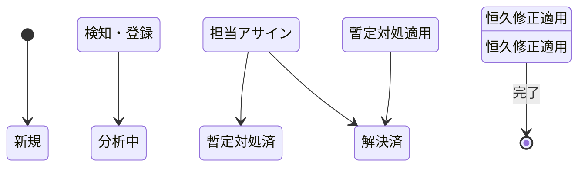

# [MNG-03] 問題管理定義書 (Problem Management Definition) - ゆうぞら (Yuzora)

本ドキュメントは、「ゆうぞら (Yuzora)」プロジェクトにおける問題管理の方針、プロセス、および管理策を定義します。システム上のバグ、セキュリティ脆弱性、意図しない挙動などの「問題」を体系的に検知・分析・解決し、再発防止を図ることを目的とします。

---

## 1. 目的とスコープ (Purpose & Scope)

### 1.1 目的
本定義書の目的は、システムに発生する不具合や障害（インシデント）、あるいは潜在的な欠陥（問題）の根本原因を特定し、暫定対処（Workaround）および恒久対策（Permanent Fix）を施すことで、システムの品質向上と運用の安定化を実現することにあります。

### 1.2 スコープ
本定義書の管理対象は、以下の項目とします。
* ユーザーからの不具合報告（挙動・レイアウト崩れ等）
* 開発・検証フェーズで検出されたバグ・仕様の不整合
* セキュリティスキャンやコード監査で検出された脆弱性
* 動作プラットフォーム（ブラウザ）の仕様変更に伴う動作不能問題

---

## 2. 問題の検知とライフサイクル (Detection & Lifecycle)

問題は検知から解決まで、以下のライフサイクルに従って管理します。

1. **新規 (New)**: ユーザーまたは検証中のエージェントによって問題が検知・記録された状態。
2. **分析中 (Analyzing)**: 根本原因調査が開始された状態。
3. **暫定対処済 (Workaround)**: 恒久対策に時間がかかる場合、サービス復旧のために一時的な回避策が適用された状態。
4. **解決済 (Resolved)**: 根本修正コードが適用され、動作検証が完了した状態。

---

## 3. 問題の分類と優先度判定 (Classification & Severity)

検知された問題は、ビジネス（読書体験）およびシステムへの影響度に基づき、以下の優先度（Severity）に分類して対応を行います。

| 優先度 | 定義・影響範囲 | 目標対応時間 | 具体例 |
| :--- | :--- | :--- | :--- |
| **High (高)** | システムが完全に動作不能、または重大なデータ損失・セキュリティ侵害が発生している状態。 | 24時間以内 | ・アプリが起動しない ・しおりデータが完全に消失する ・XSS（クロスサイトスクリプティング）などの重大な脆弱性 |
| **Medium (中)** | 主要な機能は動作するが、特定の操作や条件でエラーが発生、またはレイアウトが崩れて読書に支障が出る状態。 | 3日以内 | ・特定の青空文庫テキストのパースに失敗する ・スワイプによるページめくりが機能しない ・傍点やルビが著しく崩れる |
| **Low (低)** | 読書機能自体には直接影響しない、軽微なUI崩れやドキュメントの表記揺れなどの状態。 | 次期リリース時 | ・ボタン of ホバーアニメーションのわずかなズレ ・操作マニュアル内の微細な誤字・脱字 |

---

## 4. 根本原因分析 (Root Cause Analysis - RCA)

問題の再発を防止するため、暫定対処だけで終わらせず、以下のステップで根本原因分析（RCA）を実施します。

1. **事象の特定**: 問題が発生した具体的なファイル（`.txt`/`.html`）、ブラウザ環境、操作手順を特定する。
2. **5つの「なぜ」 (5 Whys)**: 「なぜそのエラーが起きたのか」「なぜその処理が漏れたのか」と問いを重ね、背後にある設計ミスや考慮漏れの根本原因を特定する。
3. **影響範囲評価**: 同様のバグが他のモジュールや関数（例: ルビ以外のパース規則、他テーマ）に波及していないか評価する。

---

## 5. 暫定対処と恒久対策の分離管理 (Workaround vs. Permanent Fix)

迅速な復旧と中長期的なコード品質の維持を両立するため、対処方法を以下のように分離して管理します。

* **暫定対処 (Workaround)**:
  * 障害の影響を最小化するための回避策（例: エラーハンドラーでの握り潰しや、一部機能の一時無効化）。
  * 適用した場合、必ず「恒久対策のタスク（RFC）」を起票し、暫定コードが残存し続けること（技術的負債の放置）を防止します。
* **恒久対策 (Permanent Fix)**:
  * バグの根本的な修正（例: パース用正規表現の修正、CSSボックスレイアウトの変更）。
  * 恒久対策のコード変更は、後述の「[変更管理定義書](MNG-04-change_management.md)」プロセスに従って適用されます。

---

## 6. ナレッジ共有と再発防止策 (Knowledge Base & Prevention)

解決した問題は、同一・類似バグの再発防止および他のAI Agentへの引き継ぎのためにドキュメント化します。

* **KI (Knowledge Item) システムへの登録**:
  * 重要な問題（特にセキュリティ脆弱性や、CSSマルチカラム等のブラウザ依存バグ）が解決した際は、プロジェクトの App Data 内の `knowledge/` ディレクトリにナレッジアイテム（事例、解決手順、テストPoC）を登録します。
* **回帰テスト（リグレッションテスト）ケースへの追加**:
  * 修正したバグを含むテストファイルを検証用アセットに保存し、今後のバージョンアップ時に同様のバグが再発（デグレード）していないかを自動・手動で検証できるようにします。
