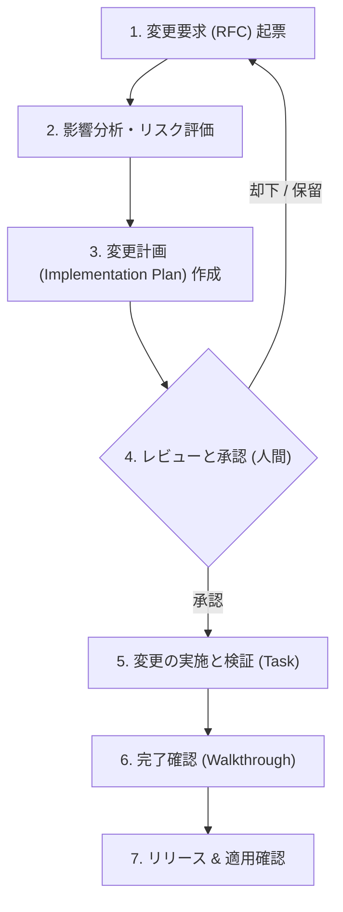

# [MNG-04] 変更管理定義書 (Change Management Definition) - ゆうぞら (Yuzora)

本ドキュメントは、「ゆうぞら (Yuzora)」プロジェクトにおける変更管理の方針、プロセス、および管理策を定義します。コードの追加・変更、仕様変更、依存ライブラリの更新などを安全かつコントロールされた手順で実施し、システムの安定性と品質を保証することを目的とします。

---

## 1. 目的と対象範囲 (Purpose & Scope)

### 1.1 目的
本定義書の目的は、システムに対するすべての変更について、その必要性、影響範囲、リスクを事前に評価し、人間とAI Agentが協調した承認および検証手順を経ることで、変更に伴う障害や品質低下（デグレード）を未然に防ぐことにあります。

### 1.2 対象範囲
本定義書の管理対象は、以下の項目とします。
* プログラムソースコード（JavaScript, CSS, HTML）の修正
* 要求定義（URD）や要件定義（SRD）などの仕様ドキュメントの変更
* アプリケーション内で利用する静的アセット（事前定義作品テキスト等）の更新
* 外部フォントやAPIなど、テクノロジー構成要素の変更

---

## 2. 変更の分類 (Change Classifications)

変更はその規模、影響、および緊急度に応じて以下の3つに分類して管理します。

| 分類 | 定義と条件 | 承認プロセス | 具体例 |
| :--- | :--- | :--- | :--- |
| **標準変更 (Standard)** | 低リスクで手順が明確に確立されている、日常的・反復的な変更。 | 事前承認済。AI Agent単独での適用および検証が可能。 | ・ドキュメントの誤字脱字修正 ・新機能を含まないリファクタリング（テストがパスすること） |
| **一般変更 (Normal)** | リスクや影響度の中〜高レベルの変更。計画から適用まで所定の承認・検証ステップを要する変更。 | 提案（RFC）の作成後、人間（User）によるレビューと承認が必要。 | ・新規機能の追加（しおり、テーマ等の新機能） ・画面レイアウトの変更 ・文字サイズや行間などの仕様パラメータの調整 |
| **緊急変更 (Emergency)** | 稼働中の深刻な障害（Highレベルの問題）の復旧や、重大なセキュリティ脆弱性の修正など、即時適用が必要な変更。 | 暫定的な事後承認を許容するが、適用後速やかに事後検証および承認手続きを行う。 | ・画面が表示されない致命的バグの解消 ・XSS（クロスサイトスクリプティング）などの重大な脆弱性の即時パッチ |

---

## 3. 変更管理プロセス (Change Control Process)

一般変更（Normal Change）は、以下のプロセスに厳格に従って実行されます。

### 3.1 変更要求 (RFC: Request for Change) の起票
* 変更の必要性、期待される効果、実装の概要を起票します。本プロジェクトでは、AI Agentが計画書（`implementation_plan.md`）を作成する形でRFCとします。

### 3.2 影響分析 (Impact Analysis) とセキュリティ評価
* **変更が与える影響**:
  * 既存機能への影響（特にスクロール位置復元、RTL/LTR進行方向、しおりの保存形式等への退行バグ防止）。
  * 非機能要件への影響（パフォーマンスの低下や、モバイル表示（1カラム）の崩れがないか）。
  * セキュリティ要件（新機能やファイルパーサーがXSSなどの脆弱性を侵入させないか）。

### 3.3 承認プロセス
* **変更の承認権限**:
  * 一般変更は、人間（User）による明示的な承認が必要です。承認されるまで、AI Agentはソースコードの書き換えやコマンドによる適用を行ってはなりません。

### 3.4 変更の実施と検証（回帰テストの方針）
* 承認後、タスクリスト（`task.md`）に沿って変更を実施します。
* 変更後、元の機能が破壊されていないかを確認するため、以下の検証を行います。
  * 既存の事前定義作品が正常に表示されるか。
  * UI（テーマ切り替え、文字サイズ調整）が正しく機能するか。

### 3.5 完了確認 (Post-Implementation Review)
* 変更の成果および検証結果を要約（`walkthrough.md`）として作成し、人間に最終確認を求めます。

---

## 4. ロールバック計画 (Rollback Plan)

変更の適用によって予期せぬ不具合が発生した場合、システムを安全に元の状態（正常稼働していた状態）に戻すための管理策です。

* **切り戻しトリガー**:
  * 変更適用後の動作検証（手動/自動）において、Highレベルの問題が検出された場合。
  * 予定された時間内に検証が完了せず、システムの正常動作が確保できない場合。
* **ロールバック手順**:
  * Git によるバージョン管理をベースとし、`git restore` または `git revert` を用いて、直前の正常稼働していたコミットハッシュまで完全にコードを巻き戻します。
  * 永続データ（LocalStorage）の構造に破壊的変更を加える場合は、古いデータ構造との後方互換性を維持するコードをあらかじめ準備しておくか、マイグレーションのクリア手順を定義します。
