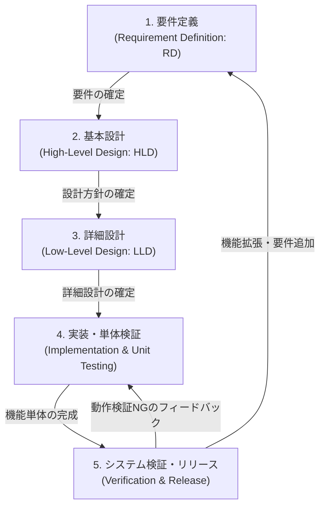

# 開発プロセスおよび成果物定義書 (Development Process & Deliverables Definition) - コイゾラ (Koizora)

本ドキュメントは、青空文庫縦書きビューアー「コイゾラ (Koizora)」におけるソフトウェア開発手法の方針、開発プロセス（工程）、各工程で作成・維持される成果物（Deliverables）、およびそれぞれの担当エージェント・担当者を定義します。

---

## 1. 開発手法の方針 (Development Methodology Policies)

コイゾラプロジェクトでは、高品質かつ迅速なプロダクト開発を実現するため、以下の開発手法・設計方針を適用します。

### 1.1 反復的かつインクリメンタルな開発プロセス (Iterative & Incremental)
本システムは単一の完成形を一度に構築するのではなく、コア機能から段階的に構築・検証を繰り返す「反復的かつインクリメンタル」な手法を採用します。
* **インクリメンタル（段階的）**: 
  1. ファイル読み込みおよび Shift_JIS デコード機能（ベースライン）
  2. 青空文庫記法（ルビ、改ページ等）のパースエンジン
  3. 縦書き・ページめくり・マルチカラム表示等のビューアー機能
  4. 表示テーマ、フォント、文字サイズ等の設定カスタマイズ機能
  5. しおり自動保存およびセッション復元機能
  のように、動作可能なインクリメントを段階的に追加します。
* **反復的（イテレーティブ）**: 
  各インクリメントごとに「要件整理・設計・実装・検証」のサイクルを反復的に回し、テスト結果やユーザーレビューに基づくフィードバックを素早く取り込んで設計・実装を磨き上げます。

### 1.2 TOGAF EA（エンタープライズアーキテクチャ）の考え方の導入
システムの全体最適とビジネス（読書体験）価値の最大化、将来の拡張性を担保するため、**TOGAF（The Open Group Architecture Framework）**のアーキテクチャ開発手法（ADM）に基づき、以下の4つのアーキテクチャドメインで設計を整理します。

1. **ビジネスアーキテクチャ (BA - Business Architecture)**:
   * **定義対象**: ユーザーの読書プロセス、青空文庫テキストの提供プロセス、本物の書籍に近い縦書き読書体験という価値の定義。
   * **ドキュメント位置づけ**: [requirement_definition.md](file:///workspace/koizora/docs/requirement_definition.md) （要件定義書）にて表現。
2. **アプリケーションアーキテクチャ (AA - Application Architecture)**:
   * **定義対象**: アプリケーションのコンポーネント構成（パースエンジン、ビューアー描画部、設定管理部、ストレージ接続部等）およびコンポーネント間のデータ連携方式。
   * **ドキュメント位置づけ**: [high_level_design.md](file:///workspace/koizora/docs/high_level_design.md) （基本設計書）の論理構成にて定義。
3. **データアーキテクチャ (DA - Data Architecture)**:
   * **定義対象**: ファイルのデータ構造（Aozora Text/HTML）、デコード仕様、LocalStorageで永続化されるしおりデータ構造の論理・物理スキーマ。
   * **ドキュメント位置づけ**: [high_level_design.md](file:///workspace/koizora/docs/high_level_design.md) （論理データ構造）および [low_level_design.md](file:///workspace/koizora/docs/low_level_design.md) （物理データスキーマ）で定義。
4. **テクノロジーアーキテクチャ (TA - Technology Architecture)**:
   * **定義対象**: 実行プラットフォーム（モダンブラウザ）、開発技術（HTML5, Vanilla CSS, Pure JavaScript）、Webフォント（Noto Serif JP等）などの物理的インフラ・技術スタック。
   * **ドキュメント位置づけ**: [high_level_design.md](file:///workspace/koizora/docs/high_level_design.md) で選定および制約事項を定義。

### 1.3 HLD（基本設計）とLLD（詳細設計）の明確な分離
アーキテクチャの変更容易性と実装の効率性を高めるため、基本設計（High-Level Design: HLD）と詳細設計（Low-Level Design: LLD）の抽象度と関心領域を明確に分けます。

| 項目 | 基本設計 (HLD) | 詳細設計 (LLD) |
| :--- | :--- | :--- |
| **主な目的** | システム構成・機能分割・論理データフローの決定 | 実装担当者・AIが迷いなくコーディングできる詳細仕様の確立 |
| **抽象度** | 論理レベル（どのようなコンポーネント・データが存在するか） | 物理レベル（実際にどうプログラムで表現し、計算するか） |
| **関心領域** | システム全体構造、画面遷移、カラー変数名、セキュリティ設計方針 | 関数名、状態変数名、具体的な正規表現、計算式、LocalStorageキー |
| **インプット** | 要件定義書 (RD) | 基本設計書 (HLD) |
| **アウトプット** | [high_level_design.md](file:///workspace/koizora/docs/high_level_design.md) | [low_level_design.md](file:///workspace/koizora/docs/low_level_design.md) |

---

## 2. 開発プロセスの全体像 (Process Overview)

開発プロセスは以下の5つの工程から構成され、反復的かつインクリメンタルに進行します。

---

## 3. 各工程における詳細定義、担当エージェントおよび成果物 (Phases, Roles & Deliverables)

### 3.1 要件定義 (Requirement Definition: RD)
* **概要**: ユーザーの課題・要求を分析し、システムの目的、動作ブラウザ環境、実装すべき機能範囲（ファイル読込、パース、表示設定、しおり等）、および非機能要件（デザイン品質、セキュリティ、パフォーマンス）を策定します。TOGAF EAのビジネスアーキテクチャ（BA）の定義に相当します。
* **担当エージェント・担当者**:
  * **主担当**: AI Agent（要求の整理・ドキュメント作成・構造化）
  * **確認・承認**: User (人間)（要件の最終承認・制約事項の提示）
* **インプット**: ユーザーからの機能要求、利用する外部公開リソース（青空文庫形式）の仕様。
* **主要成果物**:
  * [requirement_definition.md](file:///workspace/koizora/docs/requirement_definition.md) （要件定義書）
    * ユーザーの目的、対象作品（吉川英治「宮本武蔵」8作品等の最低必須対応定義）、対象フォーマット（`.txt`, `.html`, `.xhtml`）、必要なレイアウト・設定変更機能、しおり要件の定義。

### 3.2 基本設計 (High-Level Design: HLD)
* **概要**: システム全体のアーキテクチャ（MVC等）、各レイヤー（View, Controller, Storage）の役割境界、コンポーネント間の論理データフロー、共通UI/UXデザイン原則、およびエスケープ処理などの共通セキュリティ方針を定義します。TOGAF EAのAA・DA・TAの論理レベル設計に相当します。
* **担当エージェント・担当者**:
  * **主担当**: AI Agent（構造の可視化・モジュール構造化・デザインシステムの基礎設計）
  * **確認・承認**: User (人間)（アーキテクチャの整合性レビュー・承認）
* **インプット**: [requirement_definition.md](file:///workspace/koizora/docs/requirement_definition.md)
* **主要成果物**:
  * [high_level_design.md](file:///workspace/koizora/docs/high_level_design.md) （基本設計書）
    * クライアントサイドSPA構成図、ファイル読込シーケンス、カラーテーマ（4種類）とCSS変数定義、Noto Serif JPフォントの使用方針、エスケープによるXSS保護策等の記述。

### 3.3 詳細設計 (Low-Level Design: LLD)
* **概要**: 基本設計の方針に従い、プログラムの内部状態変数、JavaScript関数の動作仕様、青空文庫記法パース時の具体的な正規表現置換規則、縦書き（RTL）時のスクロール・ページ計算アルゴリズム、LocalStorageの保存データ構造（JSONスキーマ）、およびCSSのフォントサイズ・行間・文字間対応を物理レベルで定義します。
* **担当エージェント・担当者**:
  * **主担当**: AI Agent（関数の入出力仕様定義・パース正規表現の定義・アルゴリズム設計）
  * **確認・承認**: User (人間)（技術方針のフィードバック、および詳細設計の承認）
* **インプット**: [high_level_design.md](file:///workspace/koizora/docs/high_level_design.md)
* **主要成果物**:
  * [low_level_design.md](file:///workspace/koizora/docs/low_level_design.md) （詳細設計書）
    * 状態変数（`currentBook`等）の定義、ルビや改ページの正規表現マッピング、カラム数やスクロール位置に基づくページ計算式、LocalStorageデータスキーマ、CSSスタイル割り当て値の記述。

### 3.4 実装および単体検証 (Implementation & Unit Testing)
* **概要**: 詳細設計書で定義された物理ロジックを基に、HTML/CSS/JavaScriptコードを記述します。また、モックデータや検証用ファイル（Shift_JIS形式のテキスト等）を用いて、パーサーの変換精度やブラウザ上でのスタイル崩れの有無を単体レベルで検証・デバッグします。
* **担当エージェント・担当者**:
  * **主担当**: AI Agent（HTML/CSS/JSコーディング、デバッグ、単体単機能テスト）
  * **確認・レビュー**: User (人間)（コードの最終レビュー、必要に応じたUI崩れのフィードバック）
* **インプット**: [low_level_design.md](file:///workspace/koizora/docs/low_level_design.md)
* **主要成果物**:
  * [index.html](file:///workspace/koizora/index.html) （アプリ構造およびマークアップ）
  * [style.css](file:///workspace/koizora/style.css) （デザイン・テーマ・マルチカラム定義）
  * [app.js](file:///workspace/koizora/app.js) （デコード・パース・スクロールイベント等のロジック）
  * **検証用青空文庫テストファイル** （手動またはスクリプトによるパース挙動確認用のテスト用 `.txt`/`.html` データ）

### 3.5 システム検証およびリリース (System Verification & Release)
* **概要**: アプリケーション全体が要件定義を満たしているかを検証します。PC・モバイルのレスポンシブ動作、しおりの保存・自動セッション復元、大容量ファイルのロード性能、エスケープの機能性などを網羅的にテストし、動作確認が完了したファイルを本番ホスティング環境（例: GitHub Pages）へデプロイします。
* **担当エージェント・担当者**:
  * **システムテスト実行**: AI Agent（検証・動作ログ分析、Walkthrough作成）
  * **動作・UI最終検証**: User (人間)（実際のブラウザ上での操作検証、デプロイ実行、リリース承認）
* **インプット**: Phase 4 で作成されたソースコード一式。
* **主要成果物**:
  * **静的プロダクション配信ファイル群** （`index.html`, `style.css`, `app.js`）
  * [walkthrough.md](file:///root/.gemini/antigravity-ide/brain/e86b7771-850b-4ad2-a87d-6348ddf56ef8/walkthrough.md) （検証結果・変更点レポート）
  * [README.md](file:///workspace/koizora/README.md) （導入・利用マニュアル）

---

## 4. 成果物のトレーサビリティ (Deliverable Traceability)

コイゾラプロジェクトの品質を保証するため、以下の成果物間のトレーサビリティ（追跡性）を維持します。

| 追跡元の要件 (Requirement ID) | 対応する基本設計 (HLD) | 対応する詳細設計 (LLD) | 対応する実装コード |
| :--- | :--- | :--- | :--- |
| **3.1 ファイル読み込み機能** | 2.2 データフローシーケンス | 1. 状態変数 2.1 デコード処理 | `app.js`: `handleFile`, `FileReader` |
| **3.2 青空文庫記法パース機能** | 4. セキュリティ設計 | 2.1 パース正規表現、実体エスケープ | `app.js`: `parseAozoraText`, `formatAozoraMarkup` |
| **3.3 読書画面（ビューアー）機能** | 3.1 縦書き・マルチカラム構成 | 3. ページ計算・送り計算 | `index.html`: `reader-content` `app.js`: `nextPage`, `prevPage` |
| **3.4 表示カスタマイズ機能** | 3.2 テーマ定義 3.3/3.4 スタイル構成 | 5. CSS変数 5.2 クラス定義 | `style.css`: テーマクラス `app.js`: `syncButtonState` |
| **3.5 状態保持機能（しおり）** | 1.2 Storageの役割定義 | 4. LocalStorageスキーマ | `app.js`: `saveBookmark`, `checkLastSession` |
