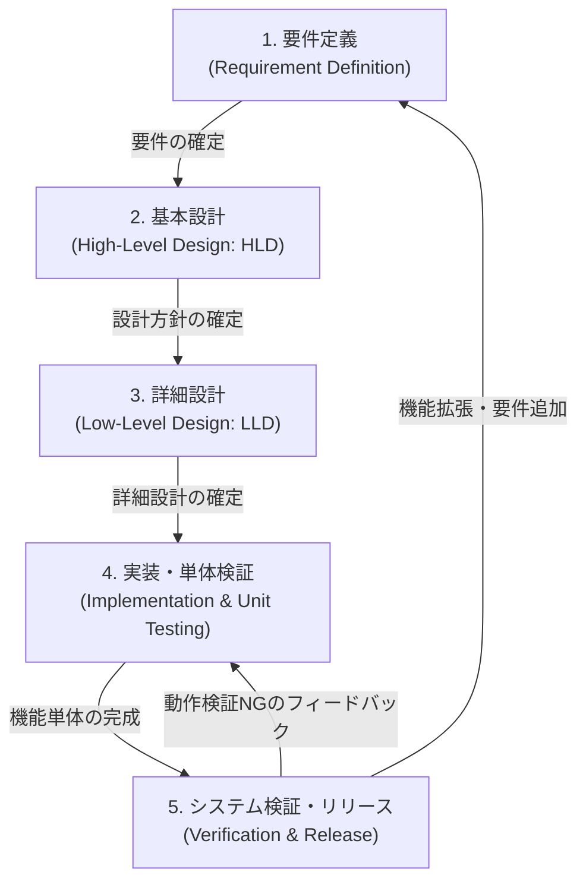

# 開発プロセスおよび成果物定義書 (Development Process & Deliverables Definition) - コイゾラ (Koizora)

本ドキュメントは、青空文庫縦書きビューアー「コイゾラ (Koizora)」におけるソフトウェア開発プロセス（工程）と、各工程で作成・維持される成果物（Deliverables）を定義します。

---

## 1. 開発プロセスの全体像 (Process Overview)

コイゾラは、軽量なクライアントサイド静的Webアプリケーションであるため、機敏かつ品質の高いリリースを継続できるよう、**反復的・インクリメンタルな開発プロセス**を採用します。

---

## 2. 各工程における詳細定義と成果物 (Phases & Deliverables)

### 2.1 要件定義 (Requirement Definition)
- **概要**: ユーザーの課題・要求を分析し、システムの目的、動作ブラウザ環境、実装すべき機能範囲（ファイル読込、パース、表示設定、しおり等）、および非機能要件（デザイン品質、セキュリティ、パフォーマンス）を策定します。
- **インプット**: ユーザーからの機能要求、利用する外部公開リソース（青空文庫形式）の仕様。
- **主要成果物**:
  - [requirement_definition.md](file:///workspace/koizora/docs/requirement_definition.md) （要件定義書）
    - ユーザーの目的、対象ファイル（`.txt`, `.html`, `.xhtml`）、必要なレイアウト・設定変更機能、LocalStorageを用いたしおり要件等の定義。

### 2.2 基本設計 (High-Level Design: HLD)
- **概要**: システム全体のアーキテクチャ（MVC等）、各レイヤー（View, Controller, Storage）の役割境界、主要コンポーネント間のデータフロー、画面遷移、カラーパレット等の共通UI/UXデザイン原則、およびXSS防止等のセキュリティ方針を定義します。
- **インプット**: [requirement_definition.md](file:///workspace/koizora/docs/requirement_definition.md)
- **主要成果物**:
  - [high_level_design.md](file:///workspace/koizora/docs/high_level_design.md) （基本設計書）
    - クライアントサイドSPA構成図、ファイル読込シーケンス、カラーテーマ（4種類）とCSS変数定義、Noto Serif JPフォントの使用方針、エスケープによるXSS保護策等の記述。

### 2.3 詳細設計 (Low-Level Design: LLD)
- **概要**: 基本設計の方針に従い、プログラムの内部変数や型、JavaScript関数の動作仕様、青空文庫記法パース時の具体的な正規表現置換規則、縦書き（RTL）時のスクロール・ページ計算アルゴリズム、LocalStorageの保存データ構造、およびCSSのユーティリティクラス（フォントサイズ・行間）を定義します。
- **インプット**: [high_level_design.md](file:///workspace/koizora/docs/high_level_design.md)
- **主要成果物**:
  - [low_level_design.md](file:///workspace/koizora/docs/low_level_design.md) （詳細設計書）
    - `currentFileName` などの状態変数の定義、ルビや改ページの正規表現（Regex）マッピング、`scrollWidth` や `scrollLeft` に基づくページ送り・進捗率計算式、LocalStorageデータスキーマ、CSS変数マッピング値の記述。

### 2.4 実装および単体検証 (Implementation & Unit Testing)
- **概要**: 詳細設計書で定義されたロジックを基に、HTML/CSS/JavaScriptコードを記述します。また、モックデータや検証用ファイル（Shift_JIS形式のテキスト等）を用いて、パーサーの変換精度やブラウザ上でのスタイル崩れの有無を単体レベルでデバッグ・検証します。
- **インプット**: [low_level_design.md](file:///workspace/koizora/docs/low_level_design.md)
- **主要成果物**:
  - [index.html](file:///workspace/koizora/index.html) （アプリ構造およびマークアップ）
  - [style.css](file:///workspace/koizora/style.css) （デザイン・テーマ・マルチカラム定義）
  - [app.js](file:///workspace/koizora/app.js) （デコード・パース・スクロールイベント等のロジック）
  - **検証用青空文庫テストファイル** （手動またはスクリプトによるパース挙動確認用のテスト用 `.txt`/`.html` データ）

### 2.5 システム検証およびリリース (System Verification & Release)
- **概要**: アプリケーション全体が要件定義を満たしているかを検証します。PC・モバイルのレスポンシブ動作、しおりの保存・自動セッション復元、大容量ファイルのロード性能、エスケープの機能性などを網羅的にテストし、動作確認が完了したファイルを本番ホスティング環境（例: GitHub Pages）へデプロイします。
- **インプット**: Phase 4 で作成されたソースコード一式。
- **主要成果物**:
  - **静的プロダクション配信ファイル群** （`index.html`, `style.css`, `app.js`）
  - [walkthrough.md](file:///root/.gemini/antigravity-ide/brain/8bbceb43-76fa-4a92-a67a-6032cb7abff5/walkthrough.md) （検証結果・変更点レポート）
  - [README.md](file:///workspace/koizora/README.md) （導入・利用マニュアル）

---

## 3. 成果物のトレーサビリティ (Deliverable Traceability)

コイゾラプロジェクトの品質を保証するため、以下の成果物間のトレーサビリティ（追跡性）を維持します。

| 追跡元の要件 (Requirement ID) | 対応する基本設計 (HLD) | 対応する詳細設計 (LLD) | 対応する実装コード |
| :--- | :--- | :--- | :--- |
| **3.1 ファイル読み込み機能** | 2.2 データフローシーケンス | 1. 状態変数 2.1 デコード処理 | `app.js`: `handleFile`, `FileReader` |
| **3.2 青空文庫記法パース機能** | 4. セキュリティ設計 | 2.1 パース正規表現、実体エスケープ | `app.js`: `parseAozoraText`, `formatAozoraMarkup` |
| **3.3 読書画面（ビューアー）機能** | 3.1 縦書き・マルチカラム構成 | 3. ページ計算・送り計算 | `index.html`: `reader-content` `app.js`: `nextPage`, `prevPage` |
| **3.4 表示カスタマイズ機能** | 3.2 テーマ定義 3.3/3.4 スタイル構成 | 5. CSS変数 5.2 クラス定義 | `style.css`: テーマクラス `app.js`: `syncButtonState` |
| **3.5 状態保持機能（しおり）** | 1.2 Storageの役割定義 | 4. LocalStorageスキーマ | `app.js`: `saveBookmark`, `checkLastSession` |
