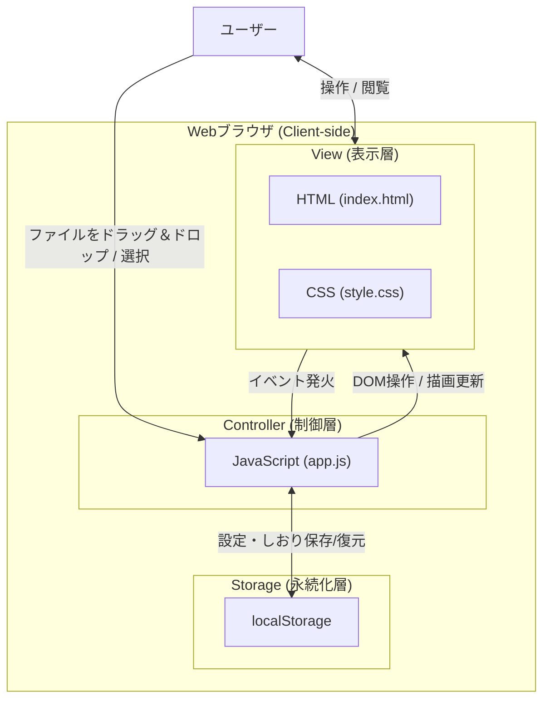
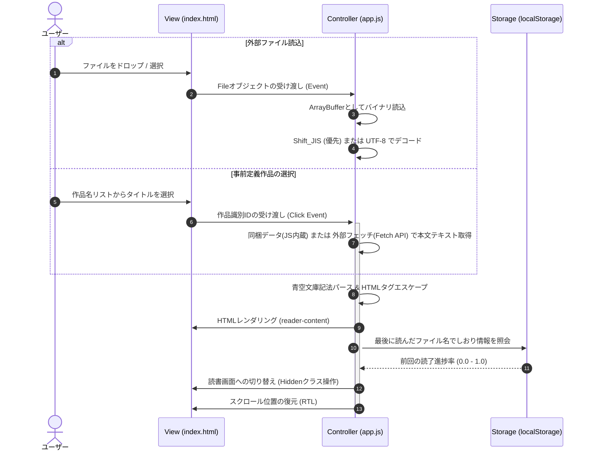

# 基本設計書 (High-Level Design) - コイゾラ (Koizora)

本ドキュメントは、要件定義書（[system_requirements.md](/docs/system_requirements.md)）に規定されたシステム要件に基づき、青空文庫縦書きビューアー「コイゾラ (Koizora)」の基本設計（High-Level Design）を定義します。

---

## 1. システム構成・アーキテクチャ (System Architecture)

コイゾラは、サーバーサイド処理を一切行わない完全な**クライアントサイド静的シングルページアプリケーション (SPA)** です。

### 1.1 アーキテクチャ図 (構造モデル)

### 1.2 各コンポーネントの役割

| レイヤー / コンポーネント | 技術・ファイル名 | 役割と責務 |
| :--- | :--- | :--- |
| **表示レイヤー (View)** | [index.html](/index.html) [style.css](/style.css) | ユーザーインターフェースの構造定義およびスタイリング。縦書き表示レイアウトの提供、各種設定パネル（ドロワー）およびウェルカム画面の構築。 |
| **制御レイヤー (Controller)** | [app.js](/app.js) | ファイル読み込み、Shift_JISデコード、青空文庫記法のパース、表示設定の動的適用、スクロール進捗率の計算、LocalStorageとの連携等のアプリケーションロジック。 |
| **永続化レイヤー (Storage)** | `localStorage` | セッションを跨いだユーザー設定（テーマ、フォントサイズ等）およびしおり情報（読了進捗率、最後に読んだファイルの内容・メタデータ）の永続化。 |

### 1.3 アーキテクチャドメインとADR（意思決定記録）の位置づけ
* **TOGAF EA との位置づけ**:
  本ドキュメントは、**TOGAF EA** の「アプリケーションアーキテクチャ (AA)」「データアーキテクチャ (DA)」「テクノロジーアーキテクチャ (TA)」における**論理（概念）設計**を定義します。各レイヤーの境界、画面遷移、カラー変数名などを論理的に規定します。
* **ADR (Architecture Decision Record) との連携**:
  本基本設計に至る過程で議論・策定された、Vanilla JSの選定、CSSマルチカラムの採用、セッション復元の持ち方などの重要なアーキテクチャ意思決定は、[docs/adr/](/docs/adr/) 配下に個別のドキュメントとして記録・管理されます。
* **設計ドキュメント間のすみ分け**:
  要件定義（SRD）や詳細設計（LLD）との境界、およびオーバーラップした際のすみ分け・分掌については、[文書管理・ドキュメント台帳](/docs/document_ledger.md) に規定されている「設計ドキュメント間のすみ分けと分掌」に従います。

---

## 2. 画面遷移とデータフロー (Screen Transitions & Data Flow)

### 2.1 画面状態 (Screen States)
アプリケーションは以下の3つの主要な画面状態を管理します。

1. **ウェルカム画面 (Welcome Screen)**
   - ファイルが読み込まれていない状態の初期画面。
   - ファイルのドラッグ＆ドロップエリア、ファイル選択ボタンを表示。
   - **事前定義作品の選択リスト**: 吉川英治「宮本武蔵」8作品の一覧を選択UIとして提示し、ユーザーがワンタップで直接読み込めるようにします。
2. **読書画面 (Reader Screen)**
   - ファイルの読み込み・パース完了、または事前定義作品のロード・パース完了後に遷移する読書メイン画面。
   - 縦書き表示、ヘッダー（自動非表示）、フッター（進捗率・ページ数表示）、ページ送りナビゲーションエリアで構成。
3. **設定ドロワー (Settings Drawer)**
   - 読書画面で「表示設定」ボタンを押した際に表示されるサイドメニュー。
   - テーマ、フォント、文字サイズ、行間、文字間などのリアルタイム変更を制御。

### 2.2 ファイル読み込みから描画までのデータフロー

---

## 3. UI/UX・デザインシステム (UI/UX & Design System)

ユーザーの「読書体験」を最優先とし、高級感のあるレイアウトとシームレスな操作性を提供します。

### 3.1 縦書き・マルチカラム・レイアウト
- CSSの `writing-mode: vertical-rl` を用い、日本語本来の右から左へ流れる縦書き読書環境を提供します。
- PCなどの大画面では**2カラム（見開き）風**、モバイルなどの小画面では**1カラム風**となるよう、CSSのマルチカラム（`column-width`）プロパティにより動的にカラム幅を設定します。

### 3.2 テーマ定義 (Theme Configuration)
読書環境に合わせて4つのカラーテーマを用意しています。

| テーマ名 | クラス名 | 背景色 | 文字色 | 設計意図・適用シーン |
| :--- | :--- | :--- | :--- | :--- |
| **和紙 (Sepia)** | `theme-sepia` | 薄いセピア調（和紙風） | 濃い焦茶 | デフォルト設定。長時間の読書でも目が疲れにくい温かみのある配色。 |
| **明 (Light)** | `theme-light` | 純白に近い明るいグレー | 漆黒に近い黒 | 明るい環境での読書向け。コントラストを重視した王道の表示。 |
| **暗 (Dark)** | `theme-dark` | ダークグレー | 明るいグレー | 夜間や薄暗い部屋での読書向け。ブルーライトを軽減。 |
| **漆黒 (Black)** | `theme-black` | 完全な黒 (`#000000`) | 薄いグレー | 有機EL(OLED)ディスプレイでの電力節約および低光量環境に最適。 |

### 3.3 フォント・書体定義 (Typography)
- **明朝体 (`font-mincho`)**: Google Fonts から `Noto Serif JP` を読み込み、小説の読書に最適なクラシックで美しい書体を提供します。
- **ゴシック体 (`font-gothic`)**: UI文字やカジュアルな可読性を重視したサンセリフ系書体を提供します。

### 3.4 表示調整オプション
ユーザーは読書画面のドロワーから以下を細かくカスタマイズ可能です。

- **文字サイズ**: 4段階（小 / 中 / 大 / 特大）
- **行間**: 3段階（狭い / 標準 / 広い）
- **文字間**: 3段階（狭い / 標準 / 広い）

---

## 4. セキュリティ設計 (Security Design)

クライアントサイドでのファイル読み込み処理において、悪意のあるスクリプト実行（クロスサイトスクリプティング: XSS）を防止するための対策を行います。

- **プレーンテキスト形式 (.txt) の場合**:
  - テキストファイル内の文字は、パース開始前に `&`, `<`, `>` などの文字をHTML実体参照（`&amp;`, `&lt;`, `&gt;`）に完全にエスケープ処理し、生のHTMLタグが実行されるのを防ぎます。
  - ルビなどの特定の青空文庫記法のみを、安全に制御された形式（`<ruby>`, `<rt>` 等）にコントローラー側で置換します。
- **HTML形式 (.html/.xhtml) の場合**:
  - `DOMParser` を介してドキュメントをパースし、ヘッダー等の不要な要素を除去した上で、コントロールされた特定のコンポーネント配下に安全にレンダリングします。

---

## 5. 技術スタック (Technology Stack)

- **フロントエンドコア**: HTML5, Vanilla CSS
- **プログラミング言語**: JavaScript (ES6+ / 外部依存ライブラリなしのピュアJS)
- **外部アセット（Webフォント）**:
  - `Noto Serif JP` (読書用明朝体フォント)
  - `Outfit`, `Inter` (UI・システムコントロール用フォント)
